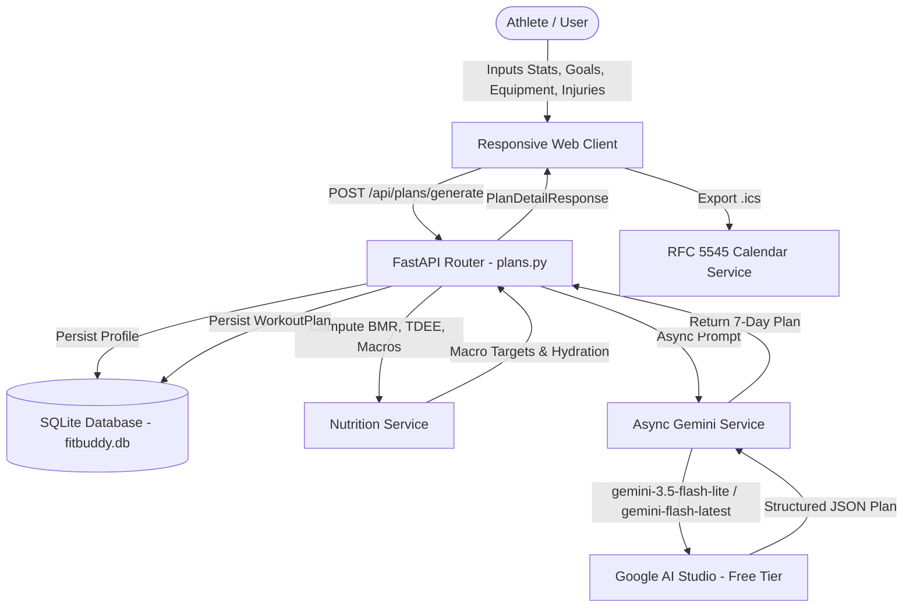

# 🏋️ FitBuddy — AI-Powered Fitness Plan & Nutrition Generator

<div align="center">

[](https://fastapi.tiangolo.com/)
[](https://www.python.org/)
[](https://aistudio.google.com/)
[](https://www.sqlalchemy.org/)
[](https://tailwindcss.com/)
[](https://opensource.org/licenses/MIT)

**An enterprise-grade, full-stack fitness and nutritional architecture delivering personalized 7-day periodized routines, dual-gender caloric targets, inter-set stopwatch timers, and 1-click calendar sync powered by Google Gemini Models.**

[Live Repository](https://github.com/codinggopi/FitBuddy---AI-Fitness-Plan-Generator-using-Gemini-Models) • [Report Issue](https://github.com/codinggopi/FitBuddy---AI-Fitness-Plan-Generator-using-Gemini-Models/issues) • [API Documentation](http://127.0.0.1:8000/api/docs)

</div>

---

## 📋 Table of Contents
- [🌟 Key Highlights](#-key-highlights)
- [📱 100% Cross-Device Responsiveness](#-100-cross-device-responsiveness)
- [⚡ 100% Free Tier AI Engine](#-100-free-tier-ai-engine)
- [🥗 Dual-Gender Mifflin-St Jeor Engine](#-dual-gender-mifflin-st-jeor-engine)
- [⏱️ Interactive Gym Suite & Calendar Sync](#-interactive-gym-suite--calendar-sync)
- [🏗️ System Architecture & Workflow](#️-system-architecture--workflow)
- [📁 Modular Package Structure](#-modular-package-structure)
- [🔌 API Endpoints Reference](#-api-endpoints-reference)
- [🚀 Quick Start & Installation](#-quick-start--installation)
- [📄 License & Author](#-license--author)

---

## 🌟 Key Highlights

- **Modular Multi-File Package Architecture**: Clean enterprise separation of concerns (`app/config.py`, `app/models/`, `app/schemas/`, `app/services/`, `app/routers/`). No monolithic script clutter.
- **100% Free API Models**: Uses Google AI Studio free tier models (`gemini-3.5-flash-lite`, `gemini-flash-latest`) with zero credit card or billing requirements.
- **True Non-Blocking Asynchronous Generation**: Uses `client.aio.models.generate_content` for high concurrency without blocking the FastAPI event loop.
- **Adaptive Parametric Fallbacks**: Guarantees offline resilience and zero crashes if network interruptions occur.
- **RFC 5545 iCalendar (.ics) Sync**: Add the entire 7-day routine directly to Google Calendar, Apple Calendar, or Outlook.
- **Dark & Light Mode Switch**: Athletic high-contrast design system with persistent local storage.

---

## 📱 100% Cross-Device Responsiveness

FitBuddy is engineered from the ground up to render flawlessly on every screen:

| Device Type | Viewport | Experience & Optimizations |
| :--- | :--- | :--- |
| **Mobile Phones** | `320px – 640px` | Single-column flow, touch-optimized minimum 44px hit targets, iOS auto-zoom prevention on inputs, swipeable horizontal day tabs (`.touch-scroll-x`), full-screen routine drawer, and mobile-docked notifications. |
| **Tablets / iPads** | `640px – 1024px` | Adaptive 2-column card layouts with fluid padding, responsive macro gauge bars, and landscape/portrait auto-scaling. |
| **Desktops & Laptops** | `1024px – 1440px` | 3-column 7-day schedule grid with elevated glassmorphism cards, ambient hover states, and smooth custom scrollbars. |
| **Ultrawide Displays** | `> 1440px` | Centered max-width container (`max-w-7xl`) preventing horizontal distortion. |

---

## ⚡ 100% Free Tier AI Engine

FitBuddy communicates with Google AI Studio's free tier quotas (up to 15 Requests/Min, 1,500 Requests/Day) with **zero billing**:

- **Primary Engine**: `gemini-3.5-flash-lite` — Sub-2-second response latency, structured JSON generation, and high availability.
- **Fallback Engine**: `gemini-flash-latest` — Auto-resolves to the newest Google Gemini Flash model.
- **Parametric Offline Engine**: If the network is unavailable, FitBuddy's sports science generator creates a tailored plan based on the user's age, weight, goal, equipment, and injuries.

---

## 🥗 Dual-Gender Mifflin-St Jeor Engine

Generic fitness tools apply a single formula regardless of sex. FitBuddy calculates Basal Metabolic Rate (BMR) and Total Daily Energy Expenditure (TDEE) with biological accuracy:

$$\text{BMR (Male)} = 10 \times \text{weight (kg)} + 6.25 \times \text{height (cm)} - 5 \times \text{age} + 5$$
$$\text{BMR (Female)} = 10 \times \text{weight (kg)} + 6.25 \times \text{height (cm)} - 5 \times \text{age} - 161$$
$$\text{BMR (Neutral)} = 10 \times \text{weight (kg)} + 6.25 \times \text{height (cm)} - 5 \times \text{age} - 78$$

- **Caloric Deficit / Surplus**: Automatically calibrates safe 15–20% deficits for fat loss or lean 10–12% surpluses for muscle hypertrophy.
- **Visual Macro Ratio Bar**: Visualizes daily gram and percentage targets for Protein, Carbohydrates, and Healthy Fats.
- **Daily Water Target**: Computes tailored daily hydration targets based on body mass and session intensity.
- **Dietary Safeguards**: Custom advice for Omnivore, Vegetarian, Vegan, Keto, Pescatarian, and Halal protocols.

---

## ⚖️ Interactive BMI & Body Composition Suite

FitBuddy features a dedicated, interactive body composition analyzer accessible from the navigation header or by tapping the BMI indicator:

- **WHO Classification Gauge**: Displays real-time categories (Underweight, Normal Weight, Overweight, Obese) with visual color spectrum indicators.
- **Estimated Body Fat % (Deurenberg Equation)**:
  $$\text{Adult Body Fat \%} = (1.20 \times \text{BMI}) + (0.23 \times \text{Age}) - (10.8 \times \text{Sex}) - 5.4$$
  *(where Sex = 1 for males, 0 for females)*
- **Healthy Weight Window**: Calculates your exact ideal weight range based on height (e.g. `56.7 kg – 76.3 kg`) and specifies your weight delta to reach optimal health.
- **1-Click Transfer to Routine Generator**: Automatically imports your height, weight, sex, and age into the workout studio and recommends the optimal fitness goal.

---

## ⏱️ Interactive Gym Suite & Calendar Sync

- **Interactive Exercise Checkboxes**: Mark exercises completed in real time with an animated weekly progress bar.
- **Inter-Set Rest Stopwatch**: Built-in 30s, 45s, 60s, 90s countdown with Web Audio synthesized acoustic chime.
- **1-Click YouTube Form Demos**: Direct YouTube search button on each exercise to verify proper lifting technique.
- **1-Click iCalendar (.ics) Sync**: Generates RFC 5545 calendar files with scheduled workout times, warmup cues, and exercise checklists.
- **Print & PDF Mode**: Custom `@media print` stylesheet that transforms the schedule into a gym sheet.
- **Routine Database Archive**: Browse, reload, or delete past routines stored in SQLite.

---

## 🏗️ System Architecture & Workflow



---

## 📁 Modular Package Structure

```
FitBuddy---AI-Fitness-Plan-Generator-using-Gemini-Models/
├── app/
│   ├── __init__.py               # Application exports & package root
│   ├── config.py                 # Centralized settings & environment loader
│   ├── database.py               # SQLite connection, session factory & auto-migration
│   ├── migrate_db.py             # Automatic SQLite column synchronization
│   ├── models/                   # SQLAlchemy ORM database models
│   │   ├── __init__.py
│   │   ├── user.py               # User entity (gender, diet, injuries, metrics)
│   │   └── workout_plan.py       # WorkoutPlan entity (json, nutrition, timestamps)
│   ├── schemas/                  # Pydantic v2 validation models
│   │   ├── __init__.py
│   │   ├── user_schema.py        # User input and response schemas
│   │   ├── plan_schema.py        # Generation, refinement, and response schemas
│   │   └── nutrition_schema.py   # Macro and energy schemas
│   ├── services/                 # Core domain & business services
│   │   ├── __init__.py
│   │   ├── gemini_service.py     # Async Gemini client (free tier) & fallbacks
│   │   ├── nutrition_service.py  # Mifflin-St Jeor engine & macro ratios
│   │   └── calendar_service.py   # RFC 5545 .ics calendar generator
│   └── routers/                  # Modular route controllers
│       ├── __init__.py
│       ├── web.py                # Home (/), History (/history), Health (/health)
│       ├── plans.py              # /api/plans (generate, refine, get, list, delete)
│       ├── nutrition.py          # /api/nutrition (calculate, tips)
│       └── export.py             # /api/export (.ics calendar, JSON downloads)
├── static/
│   ├── css/
│   │   └── styles.css            # Responsive design tokens, dark/light theme, print CSS
│   └── js/
│       └── app.js                # State store, timer, audio chime, unit converter
├── templates/
│   ├── base.html                 # Responsive base shell with navbar, drawer, footer
│   ├── index.html                # Main workout studio & 7-day suite
│   └── history.html              # Routine database archive dashboard
├── tests/
│   └── test_api.py               # Automated end-to-end integration test suite
├── run.py                        # Standard application runner (python run.py)
├── requirements.txt              # Production dependencies
├── .env.example                  # Environment configuration template
└── README.md                     # Comprehensive project documentation
```

---

## 🔌 API Endpoints Reference

| Method | Endpoint | Description |
| :--- | :--- | :--- |
| `GET` | `/` | Responsive interactive Workout Planner Studio |
| `GET` | `/history` | Routine database archive dashboard |
| `POST` | `/api/plans/generate` | Generates 7-day routine, computes macros, persists in DB |
| `POST` | `/api/plans/refine` | Refines active routine using natural language feedback |
| `GET` | `/api/plans/{plan_id}` | Retrieves a saved workout routine by ID |
| `GET` | `/api/plans` | Lists saved workout routines with pagination |
| `DELETE` | `/api/plans/{plan_id}` | Deletes a routine from SQLite database |
| `POST` | `/api/nutrition/calculate` | Calculates BMR, TDEE, and macro gram targets on the fly |
| `POST` | `/api/nutrition/bmi` | Computes BMI, WHO tier, healthy weight window & body fat % |
| `GET` | `/api/nutrition/tip/{goal}` | Fetches goal-specific nutrition advice |
| `GET` | `/api/export/{plan_id}/calendar` | Downloads `.ics` calendar routine for Google/Apple/Outlook |
| `GET` | `/api/export/{plan_id}/json` | Downloads structured JSON file of the routine |
| `GET` | `/health` | Application health and status check |

---

## 🚀 Quick Start & Installation

### 1. Prerequisites
- Python 3.10 or higher
- A free [Google Gemini API Key](https://aistudio.google.com/app/apikey)

### 2. Clone the Repository
```bash
git clone https://github.com/codinggopi/FitBuddy---AI-Fitness-Plan-Generator-using-Gemini-Models.git
cd FitBuddy---AI-Fitness-Plan-Generator-using-Gemini-Models
```

### 3. Create a Virtual Environment & Install Dependencies
```bash
# Windows
python -m venv venv
.\venv\Scripts\activate

# macOS / Linux
python3 -m venv venv
source venv/bin/activate

# Install dependencies
pip install -r requirements.txt
```

### 4. Configure Your API Key
Create a `.env` file in the project root:
```env
GEMINI_API_KEY=your_actual_gemini_api_key_here
PRIMARY_MODEL=gemini-3.5-flash-lite
FALLBACK_MODEL=gemini-flash-latest
```

### 5. Launch the Application
You can run via either:
```bash
python run.py
```
or:
```bash
uvicorn app.main:app --reload
```

Open your browser at:
`http://127.0.0.1:8000`

---

## 🧪 Automated Testing

To run the automated end-to-end integration test suite:
```bash
python tests/test_api.py
```

---

## 📄 License & Author

Developed and maintained by **[codinggopi](https://github.com/codinggopi)**.  
Repository: **[FitBuddy — AI Fitness Plan Generator using Gemini Models](https://github.com/codinggopi/FitBuddy---AI-Fitness-Plan-Generator-using-Gemini-Models)**

Distributed under the MIT License. See `LICENSE` for more information.
